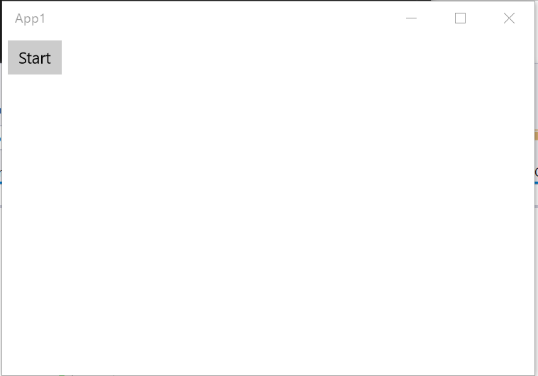
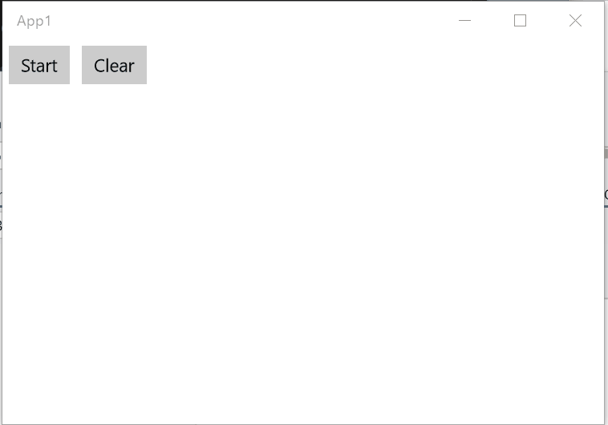
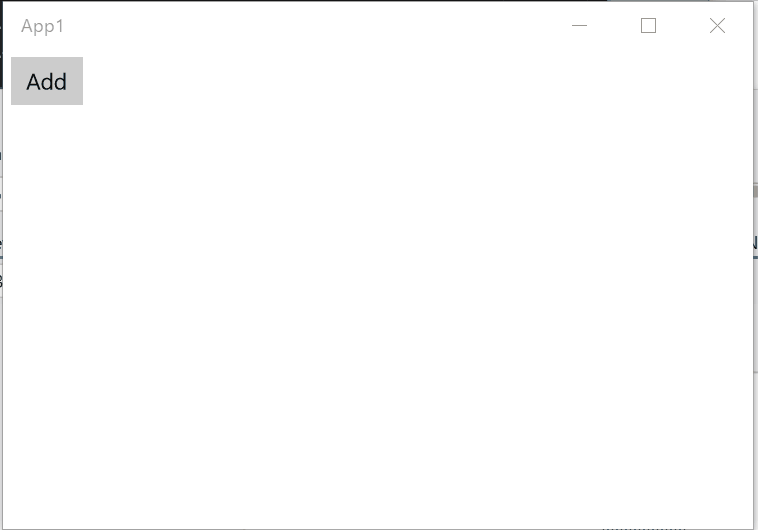
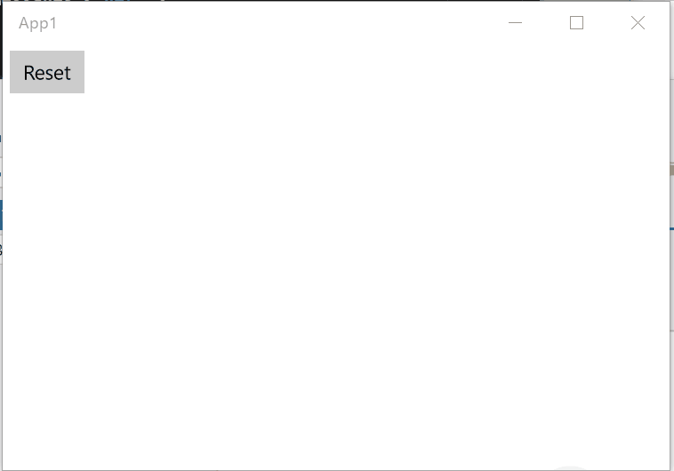
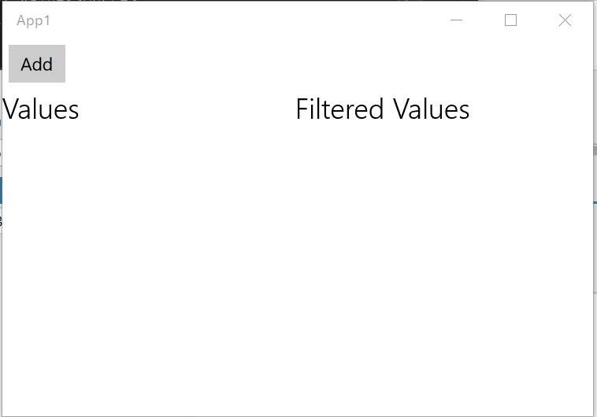

ReactiveProperty provides some collection classes.

- ReactiveCollection&lt;T&gt;
- ReadOnlyReactiveCollection&lt;T&gt;
- IFilteredReadOnlyObservableCollection&lt;T&gt;

## ReactiveCollection

ReactiveCollection hnherits ObservableCollection.
This class is created from IObservable.
And adds an item when push a value from source IObservable.
ReactiveCollection executes this process using IScheduler. Default scheduler run process on the UI thread.

```cs
public class ViewModel
{
    public ReactiveCollection<DateTime> Records { get; }

    public ReactiveCommand StartRecordCommand { get; }

    public ViewModel()
    {
        StartRecordCommand = new ReactiveCommand();
        // Create a ReactiveCollection instance from IObservable
        Records = StartRecordCommand
            .ToUnit()
            .Take(1)
            .Concat(Observable.Defer(() => Observable.Interval(TimeSpan.FromSeconds(1)).ToUnit()))
            .Select(_ => DateTime.Now)
            .ToReactiveCollection();
    }
}
```

> ToUnit extension method is defined in the Reactive.Bindings.Extensions namespace.
> This extension method is same as `.Select(_ => Unide.Default)`.

Example of UWP platform.

MainPage.xaml.cs
```cs
public sealed partial class MainPage : Page
{
    public ViewModel ViewModel { get; } = new ViewModel();
    public MainPage()
    {
        this.InitializeComponent();
    }
}
```

MainPage.xaml
```xml
<Page x:Class="App1.MainPage"
      xmlns="http://schemas.microsoft.com/winfx/2006/xaml/presentation"
      xmlns:x="http://schemas.microsoft.com/winfx/2006/xaml"
      xmlns:local="using:App1"
      xmlns:d="http://schemas.microsoft.com/expression/blend/2008"
      xmlns:mc="http://schemas.openxmlformats.org/markup-compatibility/2006"
      mc:Ignorable="d">
    <Grid Background="{ThemeResource ApplicationPageBackgroundThemeBrush}">
        <Grid.RowDefinitions>
            <RowDefinition Height="Auto" />
            <RowDefinition />
        </Grid.RowDefinitions>
        <StackPanel Orientation="Horizontal">
            <Button Content="Start"
                    Command="{x:Bind ViewModel.StartRecordCommand}"
                    Margin="5" />
        </StackPanel>
        <ListView ItemsSource="{x:Bind ViewModel.Records}"
                  Grid.Row="1" />
    </Grid>
</Page>
```



## Collection operations

ReactiveCollection class has XxxxOnScheduler methods. For example, AddOnScheduler, RemoveOnScheduler, ClearOnScheduler, GetOnScheduler, etc...
Those methods are run on the IScheduler.

Can call from outside of UI thread.

```cs
public class ViewModel
{
    public ReactiveCollection<DateTime> Records { get; }

    public ReactiveCommand StartRecordCommand { get; }

    public ReactiveCommand ClearCommand { get; }

    public ViewModel()
    {
        StartRecordCommand = new ReactiveCommand();
        // Create a ReactiveCollection instance from IObservable
        Records = StartRecordCommand
            .ToUnit()
            .Take(1)
            .Concat(Observable.Defer(() => Observable.Interval(TimeSpan.FromSeconds(1)).ToUnit()))
            .Select(_ => DateTime.Now)
            .ToReactiveCollection();

        ClearCommand = new ReactiveCommand();
        ClearCommand.ObserveOn(TaskPoolScheduler.Default) // run on the another thread
            .Subscribe(_ => Records.ClearOnScheduler());
    }
}
```

```xml
<Page x:Class="App1.MainPage"
      xmlns="http://schemas.microsoft.com/winfx/2006/xaml/presentation"
      xmlns:x="http://schemas.microsoft.com/winfx/2006/xaml"
      xmlns:local="using:App1"
      xmlns:d="http://schemas.microsoft.com/expression/blend/2008"
      xmlns:mc="http://schemas.openxmlformats.org/markup-compatibility/2006"
      mc:Ignorable="d">
    <Grid Background="{ThemeResource ApplicationPageBackgroundThemeBrush}">
        <Grid.RowDefinitions>
            <RowDefinition Height="Auto" />
            <RowDefinition />
        </Grid.RowDefinitions>
        <StackPanel Orientation="Horizontal">
            <Button Content="Start"
                    Command="{x:Bind ViewModel.StartRecordCommand}"
                    Margin="5" />
            <Button Content="Clear"
                    Command="{x:Bind ViewModel.ClearCommand}"
                    Margin="5" />
        </StackPanel>
        <ListView ItemsSource="{x:Bind ViewModel.Records}"
                  Grid.Row="1" />
    </Grid>
</Page>
```



When ReactiveCollection class was called Dispose method, then unsubscribe the source IObservable instance.

## ReadOnlyReactiveCollection

ReadOnlyReactiveCollection class provides one-way synchronization from ObservableCollection. Can set a converting logic, and dispatch CollectionChanged event raise on the IScheduler. Default IScheduler dispatch to the UI thread.

At first, exist a POCO classes.

```cs
public class BindableBase : INotifyPropertyChanged
{
    public event PropertyChangedEventHandler PropertyChanged;

    protected void RaisePropertyChanged([CallerMemberName]string propertyName = null) =>
        PropertyChanged?.Invoke(this, new PropertyChangedEventArgs(propertyName));

    protected void SetProperty<T>(ref T field, T value, [CallerMemberName]string propertyName = null)
    {
        if (EqualityComparer<T>.Default.Equals(field, value))
        {
            return;
        }

        field = value;
        RaisePropertyChanged(propertyName);
    }
}

public class TimerObject : BindableBase, IDisposable
{
    private IDisposable Disposable { get; }

    private long _count;
    public long Count
    {
        get { return _count; }
        private set { SetProperty(ref _count, value); }
    }

    public TimerObject()
    {
        Disposable = Observable.Interval(TimeSpan.FromSeconds(1))
            .Subscribe(_ => Count++);
    }

    public void Dispose()
    {
        Disposable.Dispose();
    }
}
```

This is a simple class that counts up the Count property per second.

Wrap the class to ViewModel layer using ReactiveProperty.

```cs
public class TimerObjectViewModel : IDisposable
{
    public TimerObject Model { get; }

    public ReadOnlyReactiveProperty<string> CountMessage { get; }

    public TimerObjectViewModel(TimerObject timerObject)
    {
        Model = timerObject;
        CountMessage = Model.ObserveProperty(x => x.Count)
            .Select(x => $"Count value is {x}.")
            .ToReadOnlyReactiveProperty();
    }

    public void Dispose()
    {
        Model.Dispose();
    }
}
```

Manage TimerObject instances using the ObservableCollection.
We should provide TimerObjectViewModel instances to View layer, can use ReadOnlyReactiveCollection class.
ReadOnlyReactiveCollection instance is created using ToReadOnlyReactiveCollection extension method. 

```cs
public class ViewModel
{
    // TimerObject collection
    private ReactiveCollection<TimerObject> ModelCollection { get; }
    // TimerObjectViewModel collection
    public ReadOnlyReactiveCollection<TimerObjectViewModel> ViewModelCollection { get; }

    public ReactiveCommand AddCommand { get; }

    public ReactiveCommand<TimerObjectViewModel> RemoveCommand { get; }

    public ViewModel()
    {
        AddCommand = new ReactiveCommand();
        ModelCollection = AddCommand
            .Select(_ => new TimerObject())
            .ToReactiveCollection();
        // Create a ReadOnlyReactiveCollection instance using the converting logic.
        ViewModelCollection = ModelCollection
            .ToReadOnlyReactiveCollection(x => new TimerObjectViewModel(x));

        RemoveCommand = new ReactiveCommand<TimerObjectViewModel>()
            .WithSubscribe(x => ModelCollection.Remove(x.Model));
    }
}
```

Test view is below.

```xml
<Page x:Class="App1.MainPage"
      xmlns="http://schemas.microsoft.com/winfx/2006/xaml/presentation"
      xmlns:x="http://schemas.microsoft.com/winfx/2006/xaml"
      xmlns:local="using:App1"
      xmlns:d="http://schemas.microsoft.com/expression/blend/2008"
      xmlns:mc="http://schemas.openxmlformats.org/markup-compatibility/2006"
      xmlns:viewModels="using:ViewModels"
      mc:Ignorable="d"
      x:Name="root">
    <Grid Background="{ThemeResource ApplicationPageBackgroundThemeBrush}">
        <Grid.RowDefinitions>
            <RowDefinition Height="Auto" />
            <RowDefinition />
        </Grid.RowDefinitions>
        <Button Content="Add"
                Command="{x:Bind ViewModel.AddCommand}"
                Margin="5" />
        <ListView ItemsSource="{x:Bind ViewModel.ViewModelCollection}"
                  Grid.Row="1">
            <ListView.ItemTemplate>
                <DataTemplate x:DataType="viewModels:TimerObjectViewModel">
                    <Grid>
                        <Grid.ColumnDefinitions>
                            <ColumnDefinition Width="Auto" />
                            <ColumnDefinition />
                        </Grid.ColumnDefinitions>
                        <Button Content="Remove"
                                Command="{Binding ViewModel.RemoveCommand, ElementName=root}"
                                CommandParameter="{x:Bind}"
                                Margin="5" />
                        <TextBlock Text="{x:Bind CountMessage.Value, Mode=OneWay}"
                                   VerticalAlignment="Center"
                                   Style="{ThemeResource BodyTextBlockStyle}"
                                   Grid.Column="1" />
                    </Grid>
                </DataTemplate>
            </ListView.ItemTemplate>
        </ListView>
    </Grid>
</Page>
```




When the instance was removed in the ReadOnlyReactiveCollection, then the Dispose method is called. If don't need this behavior, then set false the ToReadOnlyReactiveCollection's disposeElement argument.

```cs
ViewModelCollection = ModelCollection
    .ToReadOnlyReactiveCollection(x => new TimerObjectViewModel(x), disposeElement: false);
```

### Create from IObservable

ReadOnlyReactiveCollection can create from IObservable, it is same as the ReactiveCollection. But, ReadOnlyReactiveCollection doesn't have collection operation methods.
ToReadOnlyReactiveCollection extension method has a onReset argument which type is IObservable&lt;Unity&gt;.
When this argument raises value, then the collection is cleared.

```cs
public class ViewModel
{
    public ReadOnlyReactiveCollection<string> Messages { get; }

    public ReactiveCommand ResetCommand { get; }

    public ViewModel()
    {
        ResetCommand = new ReactiveCommand();
        Messages = Observable.Interval(TimeSpan.FromSeconds(1))
            .Select(_ => DateTime.Now.ToString("yyyy/MM/dd HH:mm:ss"))
            .ToReadOnlyReactiveCollection(ResetCommand.ToUnit());
    }
}
```

```xml
<Page x:Class="App1.MainPage"
      xmlns="http://schemas.microsoft.com/winfx/2006/xaml/presentation"
      xmlns:x="http://schemas.microsoft.com/winfx/2006/xaml"
      xmlns:local="using:App1"
      xmlns:d="http://schemas.microsoft.com/expression/blend/2008"
      xmlns:mc="http://schemas.openxmlformats.org/markup-compatibility/2006"
      mc:Ignorable="d">
    <Grid Background="{ThemeResource ApplicationPageBackgroundThemeBrush}">
        <Grid.RowDefinitions>
            <RowDefinition Height="Auto" />
            <RowDefinition />
        </Grid.RowDefinitions>
        <Button Content="Reset"
                Command="{x:Bind ViewModel.ResetCommand}"
                Margin="5" />
        <ListView ItemsSource="{x:Bind ViewModel.Messages}"
                  Grid.Row="1" />
    </Grid>
</Page>
```

When the ResetCommand execute, then clear the Messages.



## IFilteredReadOnlyObservableCollection

This provides collection which filter realtime from ObservableCollection.
IFilteredReadOnlyObservableCollection watch the PropertyChanged event of source collection item and the CollectionChanged event.

```cs
public class ValueHolder : INotifyPropertyChanged
{
    public event PropertyChangedEventHandler PropertyChanged;

    public int Id { get; set; }

    private int _value;
    public int Value
    {
        get => _value;
        set
        {
            _value = value;
            PropertyChanged?.Invoke(this, new PropertyChangedEventArgs(nameof(Value)));
        }
    }

    public ValueHolder()
    {
        var r = new Random();
        Observable.Interval(TimeSpan.FromSeconds(1))
            .ObserveOnUIDispatcher()
            .Subscribe(_ => Value = r.Next(10));
    }
}

public class ViewModel
{
    public ReactiveCollection<ValueHolder> ValuesSource { get; }

    public IFilteredReadOnlyObservableCollection<ValueHolder> Values { get; }

    public ReactiveCommand AddCommand { get; }

    public ViewModel()
    {
        AddCommand = new ReactiveCommand();
        ValuesSource = AddCommand
            .Select(_ => new ValueHolder { Id = ValuesSource.Count })
            .ToReactiveCollection();
        Values = ValuesSource.ToFilteredReadOnlyObservableCollection(
            x => x.Value > 7);
    }
}
```

> ObserveOnUIDispatcher extension method switch to the UI thread from the current thread.


```xml
<Page x:Class="App1.MainPage"
      xmlns="http://schemas.microsoft.com/winfx/2006/xaml/presentation"
      xmlns:x="http://schemas.microsoft.com/winfx/2006/xaml"
      xmlns:local="using:App1"
      xmlns:d="http://schemas.microsoft.com/expression/blend/2008"
      xmlns:mc="http://schemas.openxmlformats.org/markup-compatibility/2006"
      xmlns:viewModels="using:ViewModels"
      mc:Ignorable="d"
      x:Name="root">
    <Page.Resources>
        <DataTemplate x:Key="valueHolderDataTemplate"
                      x:DataType="viewModels:ValueHolder">
            <TextBlock>
                <Run Text="Id: " />
                <Run Text="{x:Bind Id}" />
                <Run Text=", Value: " />
                <Run Text="{x:Bind Value, Mode=OneWay}" />
            </TextBlock>
        </DataTemplate>
    </Page.Resources>
    <Grid Background="{ThemeResource ApplicationPageBackgroundThemeBrush}">
        <Grid.RowDefinitions>
            <RowDefinition Height="Auto" />
            <RowDefinition Height="Auto" />
            <RowDefinition />
        </Grid.RowDefinitions>
        <Grid.ColumnDefinitions>
            <ColumnDefinition />
            <ColumnDefinition />
        </Grid.ColumnDefinitions>
        <Button Content="Add"
                Command="{x:Bind ViewModel.AddCommand}"
                Margin="5" />
        <TextBlock Text="Values"
                   Style="{ThemeResource TitleTextBlockStyle}"
                   Grid.Row="1" />
        <ListView ItemsSource="{x:Bind ViewModel.ValuesSource}"
                  ItemTemplate="{StaticResource valueHolderDataTemplate}"
                  Grid.Row="2" />
        <TextBlock Text="Filtered Values"
                   Style="{ThemeResource TitleTextBlockStyle}"
                   Grid.Row="1"
                   Grid.Column="1" />
        <ListView ItemsSource="{x:Bind ViewModel.Values}"
                  ItemTemplate="{StaticResource valueHolderDataTemplate}"
                  Grid.Row="2"
                  Grid.Column="1" />
    </Grid>
</Page>
```



When the Value property is greater than 7, then display the value to the ListView which is the right side.

