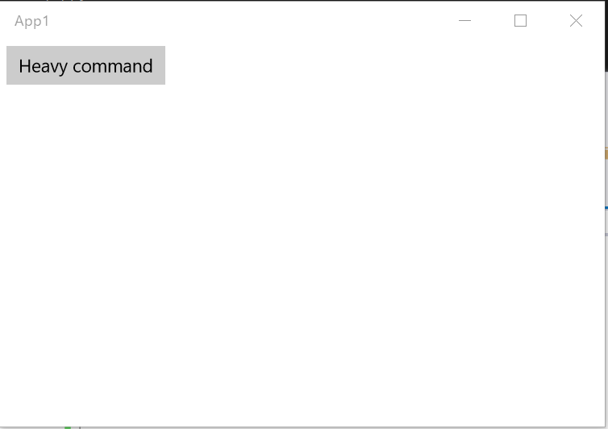
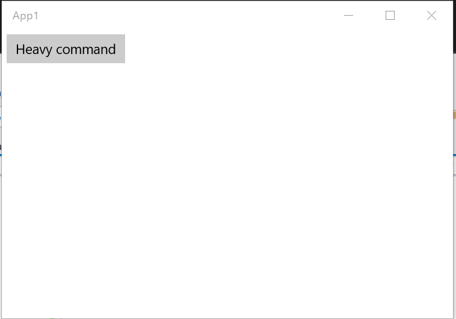
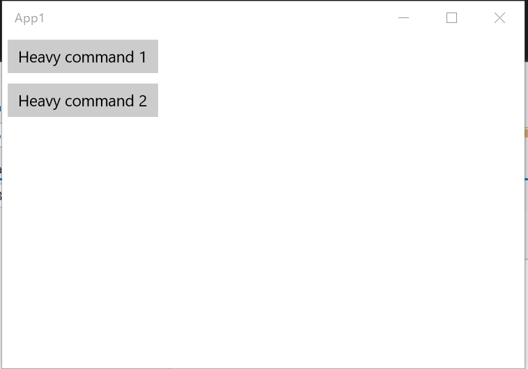

ReactiveCommand class implements following two interfaces.

- ICommand interface
- IObservable&lt;T&gt;

## Basic usage

This class can be created using ToReactiveCommand extension method from IObservable&lt;bool&gt; instance.
When IObservable&lt;bool&gt; instance updated, CanExecuteChanged event raise.

If you always want executable command, then you can create ReactiveCommand instance using the default constructor.

```cs
IObservable<bool> canExecuteSource = ...;

ReactiveCommand someCommand = canExecuteSource.ToReactiveCommand(); // non command parameter version.
ReactiveCommand<string> hasCommandParameterCommand = canExecuteSource.ToReactiveCommand<string>(); // has command parameter version
ReactiveCommand alwaysExecutableCommand = new ReactiveCommand(); // non command parameter and always can execute version.
ReactiveCommand<string> alwaysExecutableAndHasCommandParameterCommand = new ReactiveCommand<string>(); // has command parameter and always can execute version.
```

And you can set the initial return value of CanExecute method using factory extension method's initalValue argument.
The default value is true.

```cs
IObservable<bool> canExecuteSource = ...;

ReactiveCommand someCommand = canExecuteSource.ToReactiveCommand(false);
ReactiveCommand<string> hasCommandParameterCommand = canExecuteSource.ToReactiveCommand<string>(false);
```

When Execute method is called, ReactiveCommand call the OnNext callback.
You can register execute logic using the Subscribe method.

```cs
ReactiveCommand someCommand = new ReactiveCommand();
someCommand.Subscribe(_ => { ... some logic ... }); // set an OnNext callback

someCommand.Execute(); // OnNext callback is called.
```

## Using in ViewModel class

The first example, just use ReactiveCommand class.

```cs
public class ViewModel
{
    public ReactiveCommand UpdateTimeCommand { get; }

    public ReactiveProperty<string> Time { get; }

    public ViewModel()
    {
        Time = new ReactiveProperty<string>();
        UpdateTimeCommand = new ReactiveCommand();
        UpdateTimeCommand.Subscribe(_ => Time.Value = DateTime.Now.ToString("yyyy/MM/dd HH:mm:ss"));
    }
}
```

UWP platform example.

```cs
public sealed partial class MainPage : Page
{
    private ViewModel ViewModel { get; } = new ViewModel();
    public MainPage()
    {
        this.InitializeComponent();
    }
}
```

```xml
<Page x:Class="App1.MainPage"
      xmlns="http://schemas.microsoft.com/winfx/2006/xaml/presentation"
      xmlns:x="http://schemas.microsoft.com/winfx/2006/xaml"
      xmlns:local="using:App1"
      xmlns:d="http://schemas.microsoft.com/expression/blend/2008"
      xmlns:mc="http://schemas.openxmlformats.org/markup-compatibility/2006"
      mc:Ignorable="d">
    <StackPanel Background="{ThemeResource ApplicationPageBackgroundThemeBrush}">
        <Button Content="Update the time"
                Command="{x:Bind ViewModel.UpdateTimeCommand}"
                Margin="5" />
        <TextBlock Text="{x:Bind ViewModel.Time.Value, Mode=OneWay}"
                   Style="{ThemeResource BodyTextBlockStyle}"
                   Margin="5" />
    </StackPanel>
</Page>
```


## Work with LINQ

ReactiveCommand class implements IObservable&lt;T&gt; interface. 
Can use LINQ methods, and ReactiveProperty&lt;T&gt; class can create from IObservable&lt;T&gt;.
Yes, can change the previous example code to below.

```cs
public class ViewModel
{
    public ReactiveCommand UpdateTimeCommand { get; }

    // Don't need that set Value property. So can change to ReadOnlyReactiveProperty.
    public ReadOnlyReactiveProperty<string> Time { get; }

    public ViewModel()
    {
        UpdateTimeCommand = new ReactiveCommand();
        Time = UpdateTimeCommand
            .Select(_ => DateTime.Now.ToString("yyyy/MM/dd HH:mm:ss"))
            .ToReadOnlyReactiveProperty();
    }
}
```

## Create from IObservable&lt;bool&gt;

Change to that the UpdateTimeCommand don't invoke during 5 secs after the command invoked.

```cs
public class ViewModel
{
    public ReactiveCommand UpdateTimeCommand { get; }

    public ReadOnlyReactiveProperty<string> Time { get; }

    public ViewModel()
    {
        var updateTimeTrigger = new Subject<Unit>();
        UpdateTimeCommand = Observable.Merge(
            updateTimeTrigger.Select(_ => false),
            updateTimeTrigger.Delay(TimeSpan.FromSeconds(5)).Select(_ => true))
            .ToReactiveCommand();
        Time = UpdateTimeCommand
            .Select(_ => DateTime.Now.ToString("yyyy/MM/dd HH:mm:ss"))
            .Do(_ => updateTimeTrigger.OnNext(Unit.Default))
            .ToReadOnlyReactiveProperty();
    }
}
```


## Create command and subscribe, in one statement

In the case that doesn't use LINQ methods, can create command and subscribe, in one statement.
WithSubscribe extension method subscribes and return ReactiveCommand instance, see below.

```cs
public class ViewModel
{
    public ReactiveCommand UpdateTimeCommand { get; }

    public ReactiveProperty<string> Time { get; }

    public ViewModel()
    {
        Time = new ReactiveProperty<string>();

        var updateTimeTrigger = new Subject<Unit>();
        UpdateTimeCommand = Observable.Merge(
            updateTimeTrigger.Select(_ => false),
            updateTimeTrigger.Delay(TimeSpan.FromSeconds(5)).Select(_ => true))
            .ToReactiveCommand()
            .WithSubscribe(() => Time.Value = DateTime.Now.ToString("yyyy/MM/dd HH:mm:ss")); // here
    }
}
```

WithSubscribe method is a just shortcut below code.

```cs
// No use the WithSubscribe
var command = new ReactiveCommand();
command.Subscribe(_ => { ... some actions ... });

// Use the WithSubscribe
var command = new ReactiveCommand()
    .WithSubscribe(() => { ... some actions ... });
```

If use LINQ methods, then separate statements create an instance and subscribe.

## Unsubscribe actions

If need that unsubscribes actions, then use Dispose method of IDisposable which Subscribe method returned.

```cs
var command = new ReactiveCommand();
var subscription1 = command.Subscribe(_ => { ... some actions ... });
var subscription2 = command.Subscribe(_ => { ... some actions ... });

// Unsubscribe per Subscribe method.
subscription1.Dispose();
subscription2.Dispose();

// Unsubscribe all
command.Dispose();
```

WithSubscribe extension method has override methods which have an IDisposable argument.

```cs
IDisposable subscription = null;
var command = new ReactiveCommand().WithSubscribe(() => { ... some actions ... }, out subscription);

// Unsubscribe
subscription.Dispose();
```

And has another override of Action<IDisposable> argument.
It is used together with CompositeDisposable class.

```cs
var subscriptions = new CompositeDisposable();
var command = new ReactiveCommand()
    .WithSubscribe(() => { ... some actions ... }, subscriptions.Add)
    .WithSubscribe(() => { ... some actions ... }, subscriptions.Add);

// Unsubscribe
subscription.Dispose();
```

In other instance's events subscribe, then you should call the Dispose method of ReactiveCommand class when the end of ViewModel lifecycle.

## Async version ReactiveCommand

AsyncReactiveCommand class is async version ReactiveCommand class.
This class can subscribe async methods, and when executing async method then CanExecute method returns false.
So, this class can't re-execute during the async method is proceed.

### Basic usage

Neary the same as a ReactiveCommand class. 
Just difference is that accept async method in Subscribe method argument, and don't implement the IObservable&lt;T&gt; interface.

```cs
public class ViewModel
{
    public AsyncReactiveCommand HeavyCommand { get; }

    public ReactiveProperty<string> Message { get; } = new ReactiveProperty<string>();

    public ViewModel()
    {
        HeavyCommand = new AsyncReactiveCommand()
            .WithSubscribe(async () =>
            {
                Message.Value = "Heavy command started.";
                await Task.Delay(TimeSpan.FromSeconds(5));
                Message.Value = "Heavy command finished.";
            });
    }
}
```

```xml
<Page x:Class="App1.MainPage"
      xmlns="http://schemas.microsoft.com/winfx/2006/xaml/presentation"
      xmlns:x="http://schemas.microsoft.com/winfx/2006/xaml"
      xmlns:local="using:App1"
      xmlns:d="http://schemas.microsoft.com/expression/blend/2008"
      xmlns:mc="http://schemas.openxmlformats.org/markup-compatibility/2006"
      mc:Ignorable="d">
    <StackPanel Background="{ThemeResource ApplicationPageBackgroundThemeBrush}">
        <Button Content="Heavy command"
                Command="{x:Bind ViewModel.HeavyCommand}"
                Margin="5" />
        <TextBlock Text="{x:Bind ViewModel.Message.Value, Mode=OneWay}"
                   Margin="5" />
    </StackPanel>
</Page>
```



Of cause, AsyncReactiveCommand is created from IObservable&lt;bool&gt;.

```cs
public class ViewModel
{
    public AsyncReactiveCommand HeavyCommand { get; }

    public ReactiveProperty<string> Message { get; } = new ReactiveProperty<string>();

    public ViewModel()
    {
        HeavyCommand = Observable.Interval(TimeSpan.FromSeconds(1))
            .Select(x => x % 2 == 0)
            .ToAsyncReactiveCommand()
            .WithSubscribe(async () =>
            {
                Message.Value = "Heavy command started.";
                await Task.Delay(TimeSpan.FromSeconds(5));
                Message.Value = "Heavy command finished.";
            });
    }
}
```



And AsyncReactiveCommand implements the IDisposable interface.
You should call the Dispose method when the another instance's event subscribe.

### Share CanExecute state

Sometimes want only one of an async method is executing in a page.
In this case, can share CanExecute state between AsyncReactiveCommand instances.
When created from a same ReactiveProperty&lt;bool&gt; instance, then synchronize CanExecute state.

```cs
public class ViewModel
{
    private ReactiveProperty<bool> HeavyCommandCanExecuteState { get; } = new ReactiveProperty<bool>(true);
    public AsyncReactiveCommand HeavyCommand1 { get; }
    public AsyncReactiveCommand HeavyCommand2 { get; }

    public ReactiveProperty<string> Message { get; } = new ReactiveProperty<string>();

    public ViewModel()
    {
        HeavyCommand1 = HeavyCommandCanExecuteState
            .ToAsyncReactiveCommand()
            .WithSubscribe(async () =>
            {
                Message.Value = "Heavy command 1 started.";
                await Task.Delay(TimeSpan.FromSeconds(5));
                Message.Value = "Heavy command 1 finished.";
            });
        HeavyCommand2 = HeavyCommandCanExecuteState
            .ToAsyncReactiveCommand()
            .WithSubscribe(async () =>
            {
                Message.Value = "Heavy command 2 started.";
                await Task.Delay(TimeSpan.FromSeconds(5));
                Message.Value = "Heavy command 2 finished.";
            });
    }
}
```

```xml
<Page x:Class="App1.MainPage"
      xmlns="http://schemas.microsoft.com/winfx/2006/xaml/presentation"
      xmlns:x="http://schemas.microsoft.com/winfx/2006/xaml"
      xmlns:local="using:App1"
      xmlns:d="http://schemas.microsoft.com/expression/blend/2008"
      xmlns:mc="http://schemas.openxmlformats.org/markup-compatibility/2006"
      mc:Ignorable="d">
    <StackPanel Background="{ThemeResource ApplicationPageBackgroundThemeBrush}">
        <Button Content="Heavy command 1"
                Command="{x:Bind ViewModel.HeavyCommand1}"
                Margin="5" />
        <Button Content="Heavy command 2"
                Command="{x:Bind ViewModel.HeavyCommand2}"
                Margin="5" />
        <TextBlock Text="{x:Bind ViewModel.Message.Value, Mode=OneWay}"
                   Margin="5" />
    </StackPanel>
</Page>
```



## Threading

### ReactiveCommand class

When use the ReactiveCommand class, the class raise CanExecute event on a scheduler(default is UI thread scheduler.) If you want to change the behaviour then use the overload method of ToReactiveCommand which has IScheduler argument.

See below:

```cs
canExecuteSource.ToReactiveCommand(theSchedulerInstanceYouWant);
```

### AsyncReactiveCommand class

AsyncReactiveCommand class doesn't change thread automaticaly. If you want to change thread, then use `ObserveOn` method.

See below:

```cs
canExecuteSource.ObserveOn(theSchedulerInstanceYouWant).ToAsyncReactiveCommand();
```


